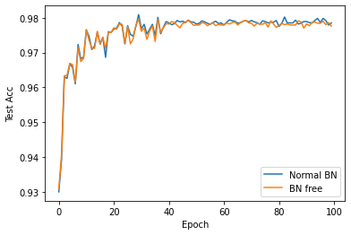
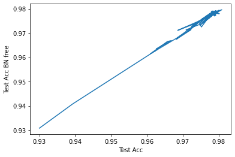

# Unofficial Pytorch implementation of Batch normalization free technique for binarized neural network (BNF)

During an inference of the binarized neural network (BNN), BNF simplifies MAC operations of batch normalization (BN) down to integers adding.

## To use

Replace `BatchNorm1d` or `BatchNorm2d` with `YonekawaBatchNorm1d`, `YonekawaBatchNorm2d` in `bnn_bn.py`. The behavior of `YonekawaBatchNorm` should be the same as the standard `BatchNorm`. However, after training, to use BN free technique, you can convert from the `forward` method to `forward_with_int_bias` instead. To get integers, you can use the method `get_int_bias`.

## With BN and BN-free

Comparing between BN and BN-free in MNIST dataset with binarized multilayer perceptron with 2 hidden layers.




## Test module

```python
python test_mnist.py
```

## Acknowledgement

We used third party codes as follows:

- [BinaryNet.pytorch](https://github.com/itayhubara/BinaryNet.pytorch): Unknown License

## Citing

```latex
@inproceedings{yonekawa2017chip,
  title={On-chip memory based binarized convolutional deep neural network applying batch normalization free technique on an FPGA},
  author={Yonekawa, Haruyoshi and Nakahara, Hiroki},
  booktitle={2017 IEEE International Parallel and Distributed Processing Symposium Workshops (IPDPSW)},
  pages={98--105},
  year={2017},
  organization={IEEE}
}
```
